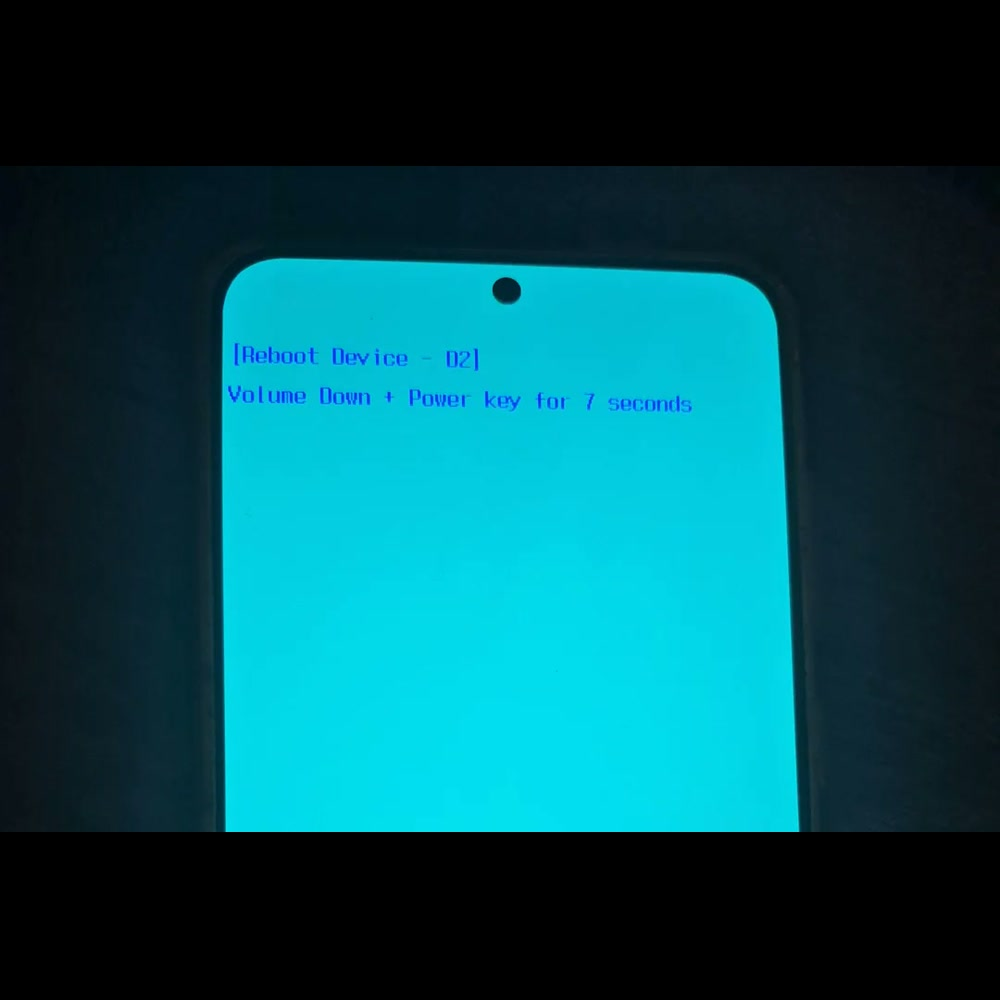
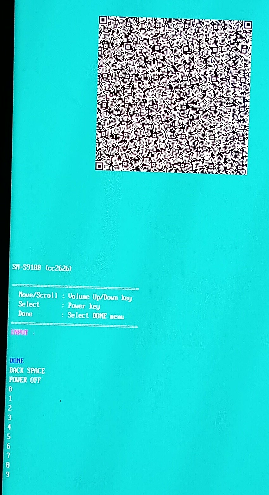

# Samsung D2 Reboot Device: The Hidden OTP/QR Gate to Download Mode

The **D2 screen** blocks access to Download/Odin Mode. Its hidden authorization
screen displays a QR Code and accepts an **eight digit code (OTP)** supplied by an
authorized operator.

## Screens

<table>
  <tr>
    <td align="center" width="50%"></td>
    <td align="center" width="50%"></td>
  </tr>
  <tr>
    <td align="center"><em>Initial D2 screen</em></td>
    <td align="center"><em>Hidden authorization screen</em></td>
  </tr>
</table>

## Usage

Keep **Power held**, then tap Volume Up **8 times**, Volume Down **5 times**,
and Volume Up **9 times**. A wrong key or releasing Power cancels the sequence.
See [Key sequence](docs/usage.md#opening-screen) for the procedure.

Use Volume Up/Down to move through the authorization menu and Power to select.
Enter the code provided for the displayed QR, including any leading zeros,
then select **DONE**.

> **Note:** Scanning the QR with an ordinary reader does not reveal the code.

## Authorization flow

A correct code allows the Download Mode confirmation for the current session.
The stored restriction remains.

**BACK SPACE** deletes the last digit. **POWER OFF** cancels the process and,
in the analyzed firmware, restarts the device.

> **Warning:** Three incorrect submissions end the session. Reopening the hidden
> screen creates a new session; request a code for the new QR.

[Complete flow](flowchart.md) documents each stage with native GitHub diagrams
and source evidence.

## Scope

Observed on a Galaxy S23 Ultra (`SM-S918B`), builds SAFZI1 and ZZI8.
Other models or versions may behave differently.

The technical wiki adapts selected original research pages. Source reports,
code excerpts and imported script identities are included in this repository;
all documentation references resolve to local files.

## Pages

| Guide | Blocks in the same page |
| --- | --- |
| [Using the hidden screen](docs/usage.md) | Opening sequence, QR, menu, attempts and result |
| [Complete graphical flow](flowchart.md) | All stages illustrated with native GitHub diagrams |
| [System and DMC policy](docs/system.md) | Architecture, Android policy, Maintenance Mode, VaultKeeper and bootloader |
| [QR protocol and screen state](docs/protocol.md) | Session fields, envelope, input state and OTP reconstruction |
| [Tools and protocol laboratory](docs/protocol-lab.md) | Included public key, encoding, decoding, QR images, inspection, extraction and Ghidra |
| [Research reference](docs/research.md) | Analysis method, function map, versions, artifact identity and glossary |
| [Original evidence](evidence/README.md) | Preserved reports, decompiled excerpts and import provenance |

## Remaining research blocker

The phone side of the OTP flow is understood: the device creates a fresh
session, places its SI and nonce inside the encrypted QR body, derives the
expected eight digit response and compares it locally. The unresolved part is
obtaining a valid response for a real device session.

Completing the flow requires one of these legitimate capabilities:

1. Access to the authorized service that can process the current QR challenge.
2. Access to the matching private RSA capability under its owner's permission,
   allowing the SI and nonce to be recovered and the documented response
   calculation to be validated.
3. A consented capture of one complete authorized exchange for the same model
   and firmware, including the displayed QR, returned response and result.

The firmware contains only the public key. That key can create compatible
laboratory envelopes but cannot reveal the matching private key or decrypt an
existing device challenge. Brute force is not a practical research path for
RSA4096. A newly generated laboratory key pair validates the reconstruction
only with synthetic sessions created using that same pair.

Useful contributions are manufacturer or service documentation, identification
of the authorized application and its access requirements, a version labelled
authorized workflow record, or confirmation of the QR header format.

Pull requests are welcome from anyone who has a reproducible solution for this
blocker, can identify the authorized service flow, or has legitimate access to
the matching private key and can validate the reconstruction against a real
session. The contribution should describe the tested model, firmware version,
method and observable result so the finding can be reviewed and reproduced.
Technical context is available in
[reconstruction and response requirements](docs/protocol.md#otp-reconstruction)
and [laboratory decode requirements](docs/protocol-lab.md#laboratory-decode-requirements)
for the evidence and technical limits behind this blocker.
