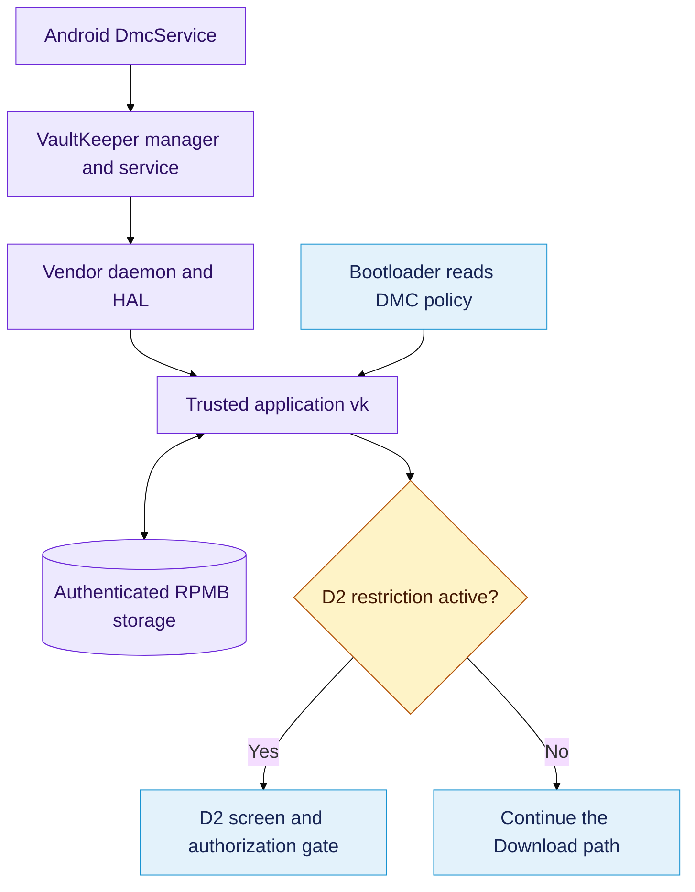
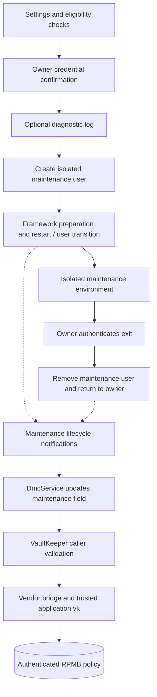

# System architecture and DMC policy

> **Related articles:** [Overview](../README.md) · [Complete flow](../flowchart.md)

The complete policy path from Android and Maintenance Mode through VaultKeeper and protected storage to the bootloader gate.

## Contents

1. [Architecture](#architecture)
2. [Android policy](#android-policy)
3. [Maintenance Mode](#maintenance-mode)
4. [VaultKeeper and trusted storage](#vaultkeeper)
5. [Bootloader and D2 gate](#bootloader)

## Architecture

### Components

The D2 decision and the hidden screen belong to different stages of the same
boot flow. Android records policy. VaultKeeper authenticates the request. The
trusted application stores and reads the vault. The bootloader consumes the
result, presents the gate and handles the QR interface.

| Layer | Component | Responsibility |
| --- | --- | --- |
| Android | `DmcService` in `system_server` | Maintain the DMC policy |
| Framework | `VaultKeeperManager` | Select the logical vault `DMC` |
| Binder | `VaultKeeperService` | Validate the Android caller |
| Vendor | `vaultkeeperd`, VaultKeeper HAL 2.0 | Transport requests to the trusted environment |
| TEE | Trusted application `vk` | Validate and store vault records |
| Storage | RPMB | Preserve authenticated records across restarts |
| Bootloader | ABL / `LinuxLoader.efi` | Read policy and decide whether D2 intervenes |
| Interface | D2 and QR/OTP routines | Collect input and verify session authorization |

### Policy path

### Session path

The hidden screen constructs its own SI and fresh nonce. The phone protects the
challenge, displays its QR and compares the entered response locally. This
session is distinct from the DMC record in storage. Session authorization clears
a runtime gate; the observed screen path does not delete the persistent vault.

> **Note:** A library or string appearing in the same firmware does not prove
> that it participates in the screen path. Follow its callers and arguments.

### Evidence

The [ZZI8 report](../evidence/sources/zzi8-report.md) consolidates the
architecture. [Vault storage analysis](../evidence/sources/vault-storage.md)
identifies the protected storage and bootloader read interface. Earlier research
initially treated RPMB as a hypothesis; the later TA analysis provides the
storage evidence used here.

## Android policy

### Record layout

`DmcService` obtains `VaultKeeperManager.getInstance("DMC")` and manages a
32 byte policy record. The first three bytes have framework semantics:

| Offset | Field | Source at Android boot completion |
| --- | --- | --- |
| 0 | `lock` | `KeyguardManager.isDeviceSecure()` |
| 1 | `maintenance` | `persist.sys.is_in_maintenance_mode` |
| 2 | `at_command` | Initially zero |

The initial record starts with `{secure, maintenance, 0}`. The remaining record
bytes must not be assigned meanings from this three field reconstruction alone.

### Updates

Credential and maintenance changes are observed by receivers. The AT field has
a corresponding service update path.

| Event | Field updated |
| --- | --- |
| Lockscreen knowledge factor changed | `lock` |
| Maintenance preprocessing or postprocessing | `maintenance` |
| `setFlagAtCommand()` | `at_command` |

The third field is reconstructed as zero on the next normal Android boot.
This does not mean that every field is cleared or that D2 is permanently removed.

### Relationship to D2

For a valid normal record, the bootloader tests the exact combination
`[1,0,0]`. This is a downstream policy decision. It must not be confused with
the QR session or with the digits entered into the hidden screen.

### Interpretation limits

A secure credential query and a maintenance property indicate what the service
would assemble. They are not a direct vault read. A device screenshot does not
establish the current values of all policy bytes.

### Evidence

[Original DmcService analysis](../evidence/sources/android-policy.md) contains
the recovered initialization, event names and field mappings.
[Bootloader policy analysis](../evidence/sources/bootloader-analysis.md)
describes the downstream comparison.

## Maintenance Mode

Maintenance Mode authenticates the owner and creates an isolated Android user for service work. Its lifecycle updates the persistent DMC policy. The hidden QR/OTP screen is a separate bootloader session; Maintenance Mode does not recover or generate that screen's response code.

### Entry and owner authentication

1. Settings routes the entry activity to `MaintenanceModeIntroFragment` through manifest metadata. The exported activity requires `ACCESS_MAINTENANCE_MODE`.
2. `MaintenanceModeUtils.checkRequiredConditions()` checks eligibility. Failed conditions prevent entry.
3. The interface offers optional Samsung Cloud or Smart Switch backup and checks secure screen lock, storage and backup/restore status.
4. The restart dialog offers diagnostic logging. `confirmSecureLock()` requires the owner's credential; cancellation stops entry.
5. After authentication and optional logging, the ViewModel rechecks secure lock and eligibility, then requests a user of type `com.samsung.android.os.usertype.full.MAINTENANCE_MODE`, with flag `1024`. A null result or exception returns the UI to a usable state.

### Profile lifecycle and trusted storage

Solid lines summarize recovered calls and transitions. Dashed lines indicate framework lifecycle relationships; the Settings extraction does not contain the complete implementation of the external Samsung framework.

The extracted implementation refers to maintenance user ID `77`. This is build specific evidence, not an Android wide identifier. The notification service and exit fragment use that ID. Exit authenticates the owner before requesting removal of the maintenance user and returning to the owner's environment.

`DmcService` updates the maintenance field at offset 1 of the 32 byte DMC record in response to lifecycle events. At normal boot completion it reconstructs `{secure, maintenance, 0}` from credential state and the maintenance property. VaultKeeper authenticates the Android caller before the trusted application accesses RPMB.

### Relationship to the hidden OTP screen

The bootloader evaluates DMC policy when entering the Download path. For valid binary policy fields, `[1,0,0]` triggers D2. Whether a specific D2 policy test passes does not prove that every other Download eligibility condition passes.

When D2 opens its hidden authorization screen, LinuxLoader creates fresh session data and a nonce, displays a protected QR challenge and verifies the response locally. Owner credential confirmation in Settings and the eight digit bootloader response are different authentication steps. Creating a maintenance profile does not disclose the response for an existing QR.

Successful screen authorization affects the current runtime gate. It does not delete the stored DMC policy or establish permanent OEM unlock. See [OTP reconstruction and obtaining a response](protocol.md#otp-reconstruction).

### Evidence and limits

- [Original complete flow](../evidence/sources/maintenance-mode-flow.md) preserves the Portuguese diagram and its original interpretation.
- [Extracted component index](../evidence/maintenance-mode/README.md) identifies activity, fragment, ViewModel, manifest and resources.
- [Entry fragment](../evidence/maintenance-mode/java/MaintenanceModeIntroFragment.java) and [ViewModel](../evidence/maintenance-mode/java/MaintenanceModeViewModel.java) provide UI orchestration; their companion lambda files preserve authentication and user-creation calls.
- [Exit fragment](../evidence/maintenance-mode/java/MaintenanceModeOutroFragment.java) and companion lambda files preserve exit authentication and removal.
- [Android policy source](../evidence/sources/android-policy.md) and [trusted storage source](../evidence/sources/vault-storage.md) support the downstream policy path.

These are static reconstruction sources, not a record of a complete live entry/exit test. Decompiled Java and smali are archived evidence, not buildable application sources. Original relative links in archived text describe the old repository; use the local links above to navigate this import. File identities are recorded in the [import manifest](../evidence/import-manifest.json).

## VaultKeeper and trusted storage

### Android authorization boundary

VaultKeeper exposes a Binder interface, but caller identity is checked before
requests reach the trusted application. The source investigation recorded:

| Caller tested | Recorded result |
| --- | --- |
| ADB shell, UID 2000 | Permission denied |
| Root, UID 0 | Not signed with the platform key |
| External execution as UID 1000 | Invalid package name |

The reconstructed service policy considers the actual process identity,
platform signature and recognized Android process/package information.
Changing a numeric UID alone does not establish the required caller identity.

### Code and storage are different artifacts

The `vk` partition contains executable ELF code for the trusted application.
It is not a plain file containing the three current policy bytes. The TA uses
RPMB operations to read and persist vault data.

Relevant recovered diagnostic names include `vkqsee_init_rpmb`,
`vkqsee_read_vault` and `vkqsee_write_vault`. The DMC entry names `system_server`
as its client and `DMC` as the logical vault.

### Compact bootloader interface

| Value | Role identified in the TA analysis |
| --- | --- |
| `0xc0de0003` | Bootloader request command |
| `0xbc06` | DMC vault identifier |
| `0x31393` | Internal vault table identifier |
| `0xb0` | Functional primary RPMB block |
| `0xb2` | Functional backup RPMB block |
| 36 bytes | Response containing status and a 32 byte payload |

The bootloader interface is a compact read path for known vaults. The Android
service interface has a larger command set and a separate authentication model.
A similarly named nonce or HOTP command elsewhere in the TA does not establish
that the hidden screen obtains its session nonce through that command.

### Record validation and fallback

The storage reconstruction checks RPMB provisioning, reads the primary record,
validates its integrity and tries the backup on a validation failure.

| Result | Reported interpretation |
| --- | --- |
| Valid primary or backup | Return the policy payload |
| Zero initialized content | `Allzero` sentinel |
| Both usable copies unavailable | `Broken` sentinel |

The names primary and backup are functional descriptions of the observed
fallback. The research did not fully reconstruct key derivation or every RPMB
frame field.

### Evidence

[VaultKeeper caller checks](../evidence/sources/vaultkeeper-access.md) documents
the Android boundary. [Trusted storage analysis](../evidence/sources/vault-storage.md)
provides the command dispatch, record table and fallback reconstruction.

## Bootloader and D2 gate

### Firmware layout

ABL is the outer bootloader artifact. The investigation identified an ELF
container with a compressed payload holding firmware volumes and PE/COFF
modules, including `OdinApp.efi` and `LinuxLoader.efi`.

The module must be identified before interpreting an address. A file offset,
RVA, virtual address and offset inside an outer image are different coordinates.

### Policy decision

The DMC request is eight bytes. The response is 36 bytes: a 32 bit status followed
by 32 payload bytes. The policy comparison consumes the first three payload bytes.

| Stage | Observed behavior |
| --- | --- |
| Transport | Start `vk` through QSEECom and request DMC data |
| Response | Check transport and response status |
| Normal record | Compare `lock`, `maintenance`, `at_command` with `[1,0,0]` |
| `Allzero` | Separate path interpreted as no lockdown |
| `Broken` | Separate error sentinel |
| Runtime state | Store the policy result in `DevAuthInfo` |

The source analysis describes a conservative failure result in its examined
policy function. This must not be generalized to every bootloader build or
combined blindly with the sentinel results.

#### Normal policy combinations

The table applies only to valid records whose three interpreted fields are
binary values. Transport failure and sentinel records are separate cases.

| lock | maintenance | at_command | Exact D2 policy test |
| --- | --- | --- | --- |
| 0 | 0 | 0 | False |
| 0 | 0 | 1 | False |
| 0 | 1 | 0 | False |
| 0 | 1 | 1 | False |
| 1 | 0 | 0 | True |
| 1 | 0 | 1 | False |
| 1 | 1 | 0 | False |
| 1 | 1 | 1 | False |

A false result means this specific D2 test does not block the path. It is not
proof that every other bootloader eligibility condition passes.

### Runtime handoff

The DMC field is at `DevAuthInfo + 0x168`. In a decompiled array of 32 bit words,
this access appears as index `0x5a`, because `0x5a × 4 = 0x168`.
The ZZI8 screen routine at `0xd70a0` reads that state, draws D2 and polls keys.

The screen disables the watchdog to permit waiting. After the complete secret
sequence it calls the QR/OTP handler. A successful response clears the runtime
gate and allows the surrounding Download path to continue. Non-success returns
from this handler reach the caller's reset path.

### Why strings are not enough

A diagnostic string can identify an area of code. It does not prove that a
particular branch is reachable or that an input field has a claimed meaning.
The policy comparison, runtime field write and field read close that evidence
chain. The complete UI flow then follows the screen and handler callers.

### Evidence

[Original bootloader analysis](../evidence/sources/bootloader-analysis.md)
contains request/response structures and the completed runtime handoff.
[ZZI8 screen excerpt](../evidence/zzi8/d2-screen.txt) preserves the input loop
and handler result path. [Function map](research.md#function-map) identifies module
boundaries and build specific addresses.
