# Fluxo completo do Modo de Manutenção

Este mapa acompanha o fluxo desde o toque do usuário em **Configurações → Modo de manutenção**, passando pelas validações, backup, criação do usuário isolado, integração com o DMC Vault e inicialização do ambiente de manutenção.

```mermaid
%%{init: {"flowchart": {"nodeSpacing": 70, "rankSpacing": 95, "curve": "basis", "padding": 30, "htmlLabels": true}, "themeVariables": {"fontSize": "22px", "fontFamily": "Arial"}}}%%
flowchart TB
    classDef user fill:#E3F2FD,stroke:#1565C0,stroke-width:4px,color:#0D47A1
    classDef settings fill:#E8F5E9,stroke:#2E7D32,stroke-width:4px,color:#1B5E20
    classDef decision fill:#FFF8E1,stroke:#F9A825,stroke-width:4px,color:#5D4037
    classDef external fill:#EDE7F6,stroke:#6A1B9A,stroke-width:4px,color:#4A148C
    classDef system fill:#E0F7FA,stroke:#00838F,stroke-width:4px,color:#004D40
    classDef secure fill:#FFF3E0,stroke:#EF6C00,stroke-width:4px,color:#E65100
    classDef boot fill:#FCE4EC,stroke:#AD1457,stroke-width:4px,color:#880E4F
    classDef success fill:#E8F5E9,stroke:#1B5E20,stroke-width:5px,color:#1B5E20
    classDef stop fill:#FFEBEE,stroke:#C62828,stroke-width:4px,color:#B71C1C

    subgraph P1["① ABERTURA EM CONFIGURAÇÕES"]
        direction LR
        U["👆 Usuário abre<br/><b>Configurações</b>"]
        MENU["🛠️ Toca em<br/><b>Modo de manutenção</b>"]
        INTENT["📨 Intent / navegação<br/><b>ENABLE_MAINTENANCE_MODE</b>"]
        ACT["📱 <b>MaintenanceModeIntroActivity</b><br/>alias vazio de SettingsActivity"]
        META["📜 Manifest metadata<br/><b>FRAGMENT_CLASS</b>"]
        FRAG["🧩 <b>MaintenanceModeIntroFragment</b><br/>tela e orquestração"]
        U --> MENU --> INTENT --> ACT --> META --> FRAG
    end

    subgraph P2["② INICIALIZAÇÃO DA TELA"]
        direction LR
        PRECHECK{"MaintenanceModeUtils<br/><b>checkRequiredConditions()</b>"}
        CLOSE["❌ Condição incompatível<br/>fecha a tela"]
        VM["🧠 <b>MaintenanceModeViewModel</b><br/>estado, executores e overlays"]
        UI["🖼️ Monta interface<br/>explica isolamento dos dados"]
        RECEIVER["📡 Registra CloudBackupReceiver<br/>e atualiza status a cada 30 s"]
        BUTTON["🔘 Exibe botão<br/><b>Ativar</b>"]
        PRECHECK -->|falha| CLOSE
        PRECHECK -->|OK| VM --> UI --> RECEIVER --> BUTTON
    end

    FRAG --> PRECHECK

    subgraph P3["③ BACKUP OPCIONAL ANTES DA ATIVAÇÃO"]
        direction LR
        BACKUP{"Usuário escolhe<br/>fazer backup?"}
        CLOUD["☁️ <b>Samsung Cloud</b><br/>startCloudActivity()"]
        SMART["💾 <b>Smart Switch</b><br/>backup externo"]
        EVENTS["📣 Broadcasts do Samsung Cloud<br/>STARTED · COMPLETED<br/>NOT_FINISHED · CANCELED"]
        SUMMARY["📊 Atualiza o resumo<br/>e o estado do backup"]
        BACKUP -->|Temporário na nuvem| CLOUD --> EVENTS --> SUMMARY
        BACKUP -->|Armazenamento externo| SMART
        BACKUP -->|Agora não| CONTINUE["Prossegue para ativação"]
    end

    BUTTON -.-> BACKUP

    subgraph P4["④ TOQUE EM ATIVAR E VALIDAÇÕES"]
        direction LR
        TAP["👆 Toque em <b>Ativar</b>"]
        LOCK{"Bloqueio de tela<br/>seguro configurado?"}
        LOCKDIALOG["🔐 Solicita PIN, senha<br/>ou padrão seguro"]
        LOCKSET["⚙️ Abre configuração<br/>de bloqueio de tela"]
        STORAGE{"Armazenamento<br/>suficiente?"}
        LOW["⚠️ Alerta de pouco espaço"]
        MYFILES["🗂️ Abre <b>My Files</b><br/>para liberar espaço"]
        BSTATUS{"Backup ou restauração<br/>em andamento?"}
        WAITBACKUP["⏳ Exige concluir, cancelar<br/>ou corrigir o backup"]
        RESTARTDIALOG["🔄 Diálogo final de reinício<br/>opção: <b>criar log</b>"]

        TAP --> LOCK
        LOCK -->|não| LOCKDIALOG --> LOCKSET -.-> TAP
        LOCK -->|sim| STORAGE
        STORAGE -->|não| LOW --> MYFILES -.-> TAP
        STORAGE -->|sim| BSTATUS
        BSTATUS -->|sim| WAITBACKUP -.-> CLOUD
        BSTATUS -->|não| RESTARTDIALOG
    end

    CONTINUE --> TAP
    SUMMARY -.-> TAP
    SMART -.-> TAP

    subgraph P5["⑤ AUTENTICAÇÃO, LOG E CRIAÇÃO DO PERFIL"]
        direction LR
        CONFIRM["🛡️ <b>confirmSecureLock()</b><br/>confirma credencial do proprietário"]
        AUTH{"Autenticação<br/>confirmada?"}
        ABORT["❌ Cancela a entrada<br/>mantém usuário principal"]
        LOG{"Criar log de diagnóstico?"}
        BUGREPORT["🪛 bugreport light_mode<br/>serviço <b>bugreportm</b><br/>espera até 5 min"]
        WAITVIEW["🔄 Overlay de espera<br/>botão desabilitado"]
        CREATE["👤 <b>UserManager.createUser()</b><br/>tipo: MAINTENANCE_MODE<br/>flag: 1024"]
        FAILCREATE["❌ Falha: remove overlay<br/>e reabilita o botão"]

        RESTARTDIALOG -->|Reiniciar| CONFIRM --> AUTH
        AUTH -->|não| ABORT
        AUTH -->|sim| LOG
        LOG -->|sim| BUGREPORT --> WAITVIEW
        LOG -->|não| WAITVIEW
        WAITVIEW --> CREATE
        CREATE -->|retorna null / exceção| FAILCREATE
    end

    subgraph P6["⑥ ANDROID SYSTEM_SERVER E TRANSIÇÃO DE USUÁRIO"]
        direction LR
        USERMGR["⚙️ <b>UserManagerService</b><br/>provisiona usuário especial"]
        UTYPE["🆔 Tipo Samsung<br/><b>com.samsung.android.os.usertype.full.<br/>MAINTENANCE_MODE</b>"]
        MMFLOW["🔄 Framework executa<br/>preparação, reinício/transição<br/>e troca para o perfil isolado"]
        PREPOST["📣 Broadcasts de ciclo de vida<br/><b>NOTIFY_PREPROCESSING</b><br/><b>NOTIFY_POSTPROCESSING</b>"]
        PROP["📌 Propriedade de estado<br/><b>persist.sys.is_in_maintenance_mode</b>"]

        CREATE -->|usuário criado| USERMGR --> UTYPE --> MMFLOW
        MMFLOW -.-> PREPOST
        MMFLOW -.-> PROP
    end

    subgraph P7["⑦ DMC VAULT: REGISTRO DO ESTADO"]
        direction LR
        DMCRX["📥 <b>DmcService</b><br/>recebe mudança do modo"]
        FLAGS["🧠 Atualiza registro de 32 bytes<br/><b>[lock, maintenance, at]</b><br/>offset maintenance = 1"]
        VKM["🔑 <b>VaultKeeperManager</b><br/>vault lógico DMC"]
        VKS["🛡️ VaultKeeperService<br/>valida o chamador"]
        HAL["🌉 vaultkeeperd + HAL<br/>ponte para o TEE"]
        TA["🛡️ Trusted App <b>vk</b><br/>integridade e acesso"]
        RPMB[("💾 <b>RPMB</b><br/>blocos DMC 0xB0 / 0xB2")]

        PREPOST --> DMCRX
        DMCRX --> FLAGS --> VKM --> VKS --> HAL --> TA
        TA <-->|leitura/escrita autenticada| RPMB
    end

    subgraph P8["⑧ APÓS O REINÍCIO: AMBIENTE ISOLADO"]
        direction LR
        BOOT["🚀 Boot concluído<br/>DmcService reconstrói estado"]
        BOOTFLAGS["📝 Grava estado inicial<br/><b>{secure, maintenance, 0}</b>"]
        USER77["👤 Usuário de manutenção<br/><b>ID observado: 77</b>"]
        ISOLATED["🧰 Dados e contas do proprietário<br/>isolados do técnico"]
        SERVICE["🔔 <b>MaintenanceModeNotificationService</b><br/>processo :ui"]
        MARK["🛠️ Notificação persistente<br/>+ marca visual na tela"]
        READY["✅ <b>Modo de manutenção ativo</b><br/>ambiente pronto para assistência"]

        MMFLOW --> BOOT --> BOOTFLAGS --> VKM
        BOOT --> USER77 --> ISOLATED --> SERVICE --> MARK --> READY
    end

    subgraph P9["⑨ SAÍDA DO MODO DE MANUTENÇÃO"]
        direction LR
        EXITOPEN["👆 Toque na notificação<br/>ou ação DISABLE"]
        OUTRO["📱 <b>MaintenanceModeOutroActivity</b><br/>MaintenanceModeOutroFragment"]
        EXITAUTH["🔐 Confirma credencial<br/>do proprietário"]
        REMOVE["🗑️ <b>UserManager.removeUser(77)</b>"]
        EXITFLOW["🔄 Reinício/transição<br/>para usuário principal"]
        CLEAR["🧠 DmcService atualiza<br/><b>maintenance = 0</b>"]
        OWNER["✅ Ambiente normal<br/>do proprietário restaurado"]

        READY --> EXITOPEN --> OUTRO --> EXITAUTH --> REMOVE --> EXITFLOW
        EXITFLOW -.-> CLEAR --> VKM
        EXITFLOW --> OWNER
    end

    class U,MENU user
    class INTENT,ACT,META,FRAG,VM,UI,RECEIVER,BUTTON,TAP,RESTARTDIALOG,CONFIRM,WAITVIEW,OUTRO settings
    class PRECHECK,BACKUP,LOCK,STORAGE,BSTATUS,AUTH,LOG decision
    class CLOUD,SMART,EVENTS,LOCKSET,MYFILES,BUGREPORT external
    class CREATE,USERMGR,UTYPE,MMFLOW,PREPOST,PROP,DMCRX,FLAGS,BOOT,BOOTFLAGS,USER77,SERVICE,EXITFLOW,REMOVE system
    class VKM,VKS,HAL,TA,RPMB secure
    class ISOLATED,MARK,READY,OWNER success
    class CLOSE,LOCKDIALOG,LOW,WAITBACKUP,ABORT,FAILCREATE stop
```

## Como ler

- **Linhas contínuas:** chamadas e transições diretamente observadas no APK `SecSettings` ou no `DmcService` analisado.
- **Linhas tracejadas:** retorno do usuário à tela ou ligação de ciclo de vida coordenada pelo framework Samsung entre a criação/remoção do perfil e os broadcasts do modo.
- A Activity de entrada não implementa a lógica: ela herda `SettingsActivity`, que carrega `MaintenanceModeIntroFragment` a partir do manifesto.
- O perfil de manutenção é um **usuário Android separado**, não apenas uma tela ou flag visual.
- O `DmcService` persiste o estado relevante no vault `DMC` através de VaultKeeper e da TA `vk`.

## Fontes locais da reconstrução

- [`Reverse Engineering/App/MaintenanceMode/`](Reverse%20Engineering/App/MaintenanceMode/)
- [`docs/03-dmcservice-e-flags.md`](docs/03-dmcservice-e-flags.md)
- [`docs/04-vaultkeeper-e-tee.md`](docs/04-vaultkeeper-e-tee.md)
- [`docs/12-engenharia-reversa-ta-vk.md`](docs/12-engenharia-reversa-ta-vk.md)
