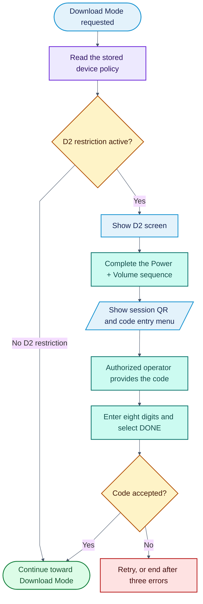
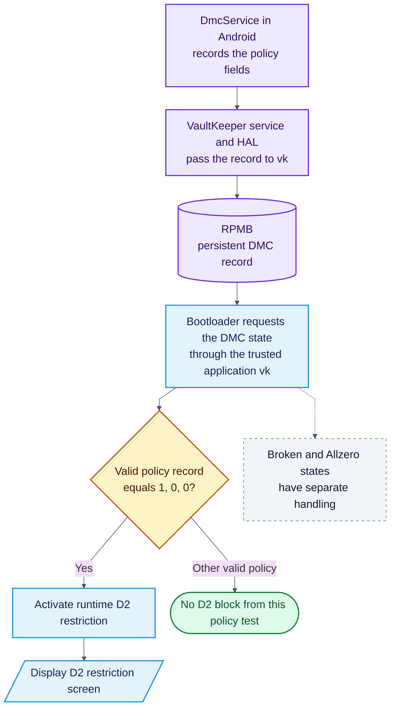
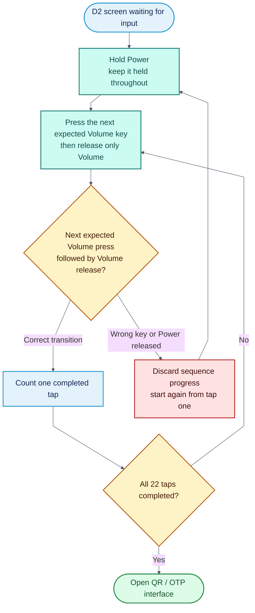
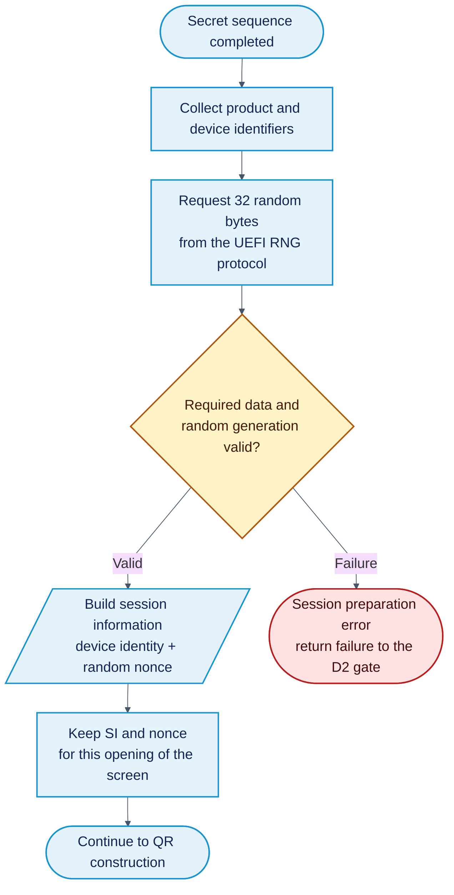
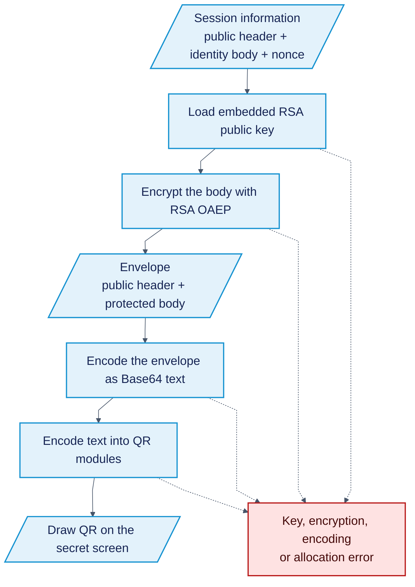
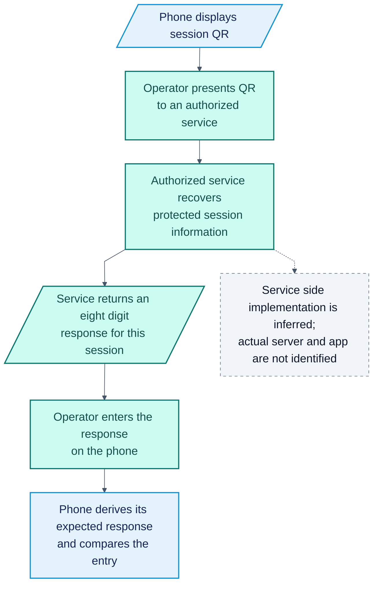
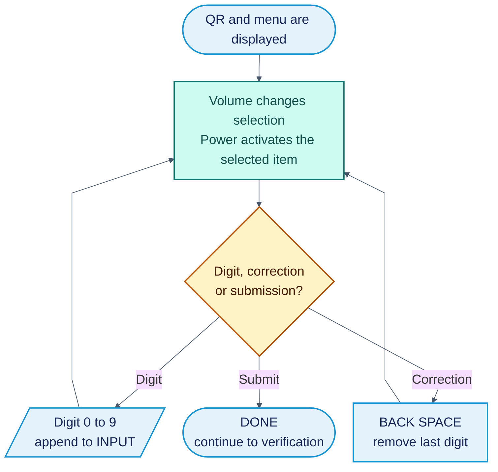
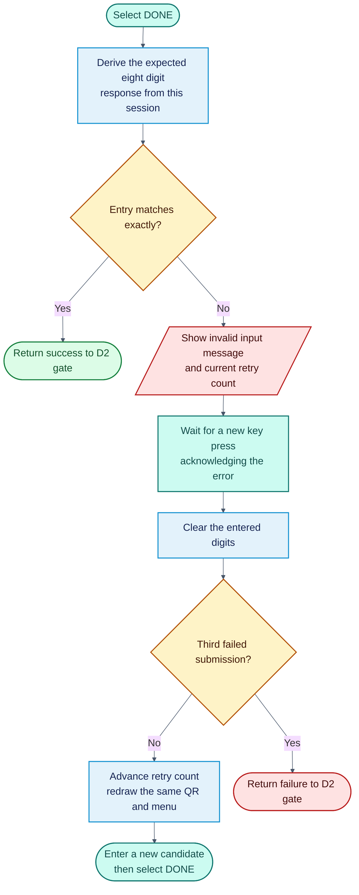
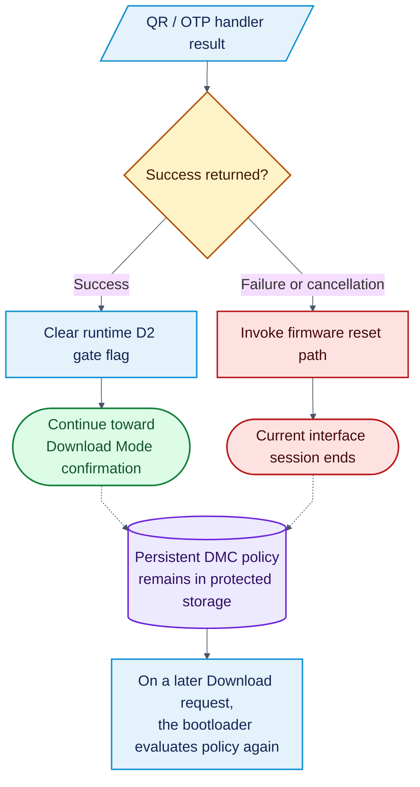

# D2 secret screen: complete flow

> **Related articles:** [Overview](README.md) · [Key sequence](docs/usage.md#opening-screen) · [QR and OTP](docs/usage.md#qr-and-code)

This article documents the complete hidden QR/OTP authorization flow, its data
sources, interface behavior and outcomes. Each stage uses a native GitHub diagram.

The main reference is **Galaxy S23 Ultra / SM-S918B, build ZZI8**. This is a
reconstruction from firmware analysis, not a claim that every Samsung model
behaves identically. The authorized service side is inferred from the phone's
protocol; its actual application, server and operator procedure were not recovered.

## Contents

1. [Reading the diagrams](#reading-the-diagrams)
2. [The complete journey](#the-complete-journey)
3. [Why the phone shows D2](#why-the-phone-shows-d2)
4. [Opening the secret screen](#opening-the-secret-screen)
5. [Creating a new authorization session](#creating-a-new-authorization-session)
6. [Turning session information into the QR](#turning-session-information-into-the-qr)
7. [Phone, operator and authorized service](#phone-operator-and-authorized-service)
8. [What is shown and how the menu works](#what-is-shown-and-how-the-menu-works)
9. [Verification, retry and the three attempt limit](#verification-retry-and-the-three-attempt-limit)
10. [What the final result changes](#what-the-final-result-changes)
11. [Evidence map and limits](#evidence-map-and-limits)

## Reading the diagrams

| Color | Meaning |
| --- | --- |
| Purple | Policy and persistent storage |
| Blue | Phone actions, interface and session data |
| Teal | Human actions and the authorized service |
| Amber | Decisions and validation |
| Green | Successful authorization |
| Red | Error, cancellation or session end |
| Gray, dashed | Explanation or scope limit |

**Shapes:** rounded ends mark entry or outcome; rectangles are actions;
parallelograms are input/output; cylinders are storage; diamonds are decisions.
Color is reinforced by labels and shapes.

## The complete journey

**Evidence:** [ZZI8 report, overview and architecture](evidence/sources/zzi8-report.md#L3).

## Why the phone shows D2

The restriction is determined before the secret screen opens. Android records the
DMC policy through VaultKeeper. The trusted application `vk` stores it in RPMB,
a protected storage area. During a Download Mode request, the bootloader reads
that policy and decides whether D2 must intervene.

| Policy field | What it represents |
| --- | --- |
| `lock` | Secure lock requested |
| `maintenance` | Maintenance state |
| `at_command` | AT authorization/exception path |

The D2 triggering combination is **lock = 1, maintenance = 0, at_command = 0**.
For example, `[0,0,0]` does not trigger this test. This describes the D2 gate;
other boot conditions can still affect whether Download Mode proceeds.

The research places the policy result in `DevAuthInfo` at offset `+0x168`.
The screen routine reads that runtime result. A screen refresh or a new input
attempt does not rewrite the stored policy.

**Evidence:** [ZZI8 report, policy fields and D2 gate](evidence/sources/zzi8-report.md#L128).

## Opening the secret screen

Keep **Power held** while tapping Volume Up **8 times**, Volume Down **5 times**,
then Volume Up **9 times**. Release Volume after every tap. The sequence opens
the authorization interface; it is not itself an authorization code.

A tap has two parts: press the expected Volume key while holding Power,
then release only Volume. The count advances on the release. Holding Volume
produces one held state, not repeated taps.

The input table contains **22 entries**. In ZZI8 it is at `0x1ad720`; in SAFZI1,
`0x1ac6d0`. Those are different builds, not interchangeable addresses. Sequence
errors restart the sequence; they are separate from the three OTP submissions.

**Evidence:** [ZZI8 report, key table and tap transitions](evidence/sources/zzi8-report.md#L156).

**Evidence:** [ZZI8 decompilation, screen and input loop](evidence/zzi8/d2-screen.txt#L1-L129).

## Creating a new authorization session

Opening the secret screen starts a new session. The phone gathers its identity
information and creates a fresh random value, called a **nonce**. It builds the
session information (SI) from these values before displaying the QR.

### Where each session field comes from

| Field in the body | Origin in the analyzed build | Purpose |
| --- | --- | --- |
| PID | Product constant, `10004` | Product/service category |
| Model | Build constant, `SM-S918B` | Identify the model |
| Software version | Build constant, `S918BXXUAZZI8` | Identify the firmware |
| DID | Platform device identifier | Identify the device |
| UN | Identifier returned by the platform | Additional device identity |
| SN | Device serial returned by the platform | Serial identity |
| IMEI | Cellular identifier returned by the platform | Cellular identity |
| Nonce | 32 freshly generated random bytes | Distinguish this session |

These fields form a colon separated body. The nonce is represented as Base64
inside that body. The phone also retains the original binary nonce for local
verification. The reported body limit is 256 bytes.

The generator rejects missing RNG access, failed random generation and an
all zero nonce. These are preparation failures, not wrong code submissions.
The exact meaning of every platform identifier should not be inferred beyond
the field names recovered from the firmware.

**Evidence:** [ZZI8 report, SI fields and RNG](evidence/sources/zzi8-report.md#L213).

**Evidence:** [ZZI8 decompilation, identity builder and RNG checks](evidence/zzi8/identity-builder.txt#L1-L603).

## Turning session information into the QR

The QR is a transport for an authorization challenge. It does not display the
answer. The phone leaves a short header readable and protects the sensitive
body with the embedded public encryption key.

| Stage | Observed representation |
| --- | --- |
| Public header | First 29 bytes retained in clear |
| Protected body | RSA4096 OAEP, reported SHA1 / MGF1 SHA1 |
| Encrypted block | 512 bytes |
| Envelope | 541 bytes: header plus encrypted block |
| Text carried by the QR | Base64, 724 characters |
| QR encoding | Version 30, HIGH error correction |
| QR matrix | 137 × 137 modules |
| Screen drawing | 5 × 5 pixels per module in ZZI8 |

The numeric lengths describe the analyzed firmware. The fixed 29 byte boundary
is directly visible in the copying/encryption path. The exact textual field
widths of the header are less certain because the variadic formatting call was
imperfectly recovered; this document does not assign an unproven width to the
software version string.

The renderer paints the QR modules. Pixel position, display scale and error
correction do not supply the authorization code. A normal reader obtains the
encoded challenge, not the protected nonce in clear.

**Evidence:** [ZZI8 report, QR envelope and rendering](evidence/sources/zzi8-report.md#L257).

**Evidence:** [ZZI8 decompilation, public key loading and QR construction](evidence/zzi8/otp-handler.txt#L85-L185).

## Phone, operator and authorized service

The phone can verify a response locally because it already has the session
information and nonce. The authorized side needs access to the matching private
key to recover the protected challenge. The person operating the buttons carries
the response back to the phone.

In the ZZI8 reconstruction, the local response is derived with **HMAC SHA256**,
using the binary session nonce and the complete SI. Dynamic truncation produces
a number formatted as eight decimal digits, including leading zeros.

The QR and response are linked by the same session data. The RSA public key
embedded in the phone protects the outgoing challenge; it does not provide the
private key capability needed to recover a displayed challenge.

No time based expiry counter was identified in the local verification path.
The observed session boundary is opening the interface and generating fresh
random data. Remote service expiration, account checks, logging and network
requirements are not established by this firmware analysis.

**Evidence:** [ZZI8 report, local verification and reconstructed service exchange](evidence/sources/zzi8-report.md#L319).

**Evidence:** [ZZI8 decompilation, local derivation and comparison](evidence/zzi8/otp-handler.txt#L328-L360).

## What is shown and how the menu works

  

**Visual reference:** project photograph, `images/otp-screen.jpg`. The behavior
below is sourced from the firmware report and decompilation, not inferred solely
from the image.

The screen contains the QR, device identification, control hints, an `INPUT`
field and a selection menu. The input field shows the digits entered so far.
The display function draws these elements; the input handler interprets the keys.

| Control | Behavior in ZZI8 |
| --- | --- |
| Volume Up | Move backward through the menu |
| Volume Down | Move forward through the menu |
| End of the menu | Selection wraps around |
| Power | Activate the selected item |
| `0` to `9` | Append the selected digit |
| `BACK SPACE` | Delete the last digit, if present |
| `DONE` | Submit the entry for comparison |
| `POWER OFF` | Leave through the cancellation path |

The 13 menu items are ordered: **DONE, BACK SPACE, POWER OFF, 0, 1, 2, 3, 4,
5, 6, 7, 8, 9**. Merely moving the selection does not submit the code.

Although the input buffer accepts up to **10 characters**, the expected response
is exactly **8 digits**. A shorter or longer entry will not match. Leading zeros
must be entered. At the input limit, additional digits are not appended.

Editing or scrolling does not create a new QR. `DONE` triggers verification;
`BACK SPACE` only edits the entry. Cancellation returns a unsuccessful outcome;
the D2 caller in this reconstruction invokes the firmware reset service. The
menu label alone should not be read as proof of a universal power off behavior.

**Evidence:** [ZZI8 report, menu layout and controls](evidence/sources/zzi8-report.md#L382).

**Evidence:** [ZZI8 decompilation, scrolling, editing and input length](evidence/zzi8/otp-handler.txt#L205-L330).

## Verification, retry and the three attempt limit

The attempt counter starts at **1**, with **3** as the displayed limit. The phone
compares the submitted string against its own expected eight digit string.
A wrong submission displays `Invalid input!!! Retry count (...)`.

| Submission | If correct | If incorrect |
| --- | --- | --- |
| 1 | Return success | Error acknowledgment, clear input, retry |
| 2 | Return success | Error acknowledgment, clear input, retry |
| 3 | Return success | Error acknowledgment, exit with failure |

The nonce and SI are created **before** the retry loop. All three submissions
therefore use the same QR session and expected response. The handler redraws the
screen on retries; it does not generate a replacement nonce for each wrong code.

The decompiled path waits for a new key transition after the error message and
clears the entered buffer before continuing or exiting. The diagram separates
that acknowledgment from the submission so the interaction is explicit.

**Evidence:** [ZZI8 decompilation, session creation before retry loop](evidence/zzi8/otp-handler.txt#L97-L185).

**Evidence:** [ZZI8 decompilation, comparison and error acknowledgment](evidence/zzi8/otp-handler.txt#L328-L405).

## What the final result changes

The QR/OTP handler reports its outcome to the D2 screen routine. On success,
the D2 path clears the runtime gate flag and returns to the Download flow. This
is session authorization, not deletion of the stored DMC record.

Opening the secret screen, scrolling the menu and obtaining a code do not
permanently remove the restriction. After a new opening, request a response for
the **new QR**. The session data changes; a previous response is not intended
for that new challenge.

The successful outcome described here is permission to continue along the
Download path. It does not establish bootloader unlocking, data erasure,
firmware installation success or a permanent change in device policy.

**Evidence:** [ZZI8 decompilation, handler result and reset path](evidence/zzi8/d2-screen.txt#L102-L129).

## Evidence map and limits

The local source snapshots and decompilation excerpts below come from research revision
`b8131475fd75f8f5f54b3485c611a00774068620`. Addresses in this table refer to
**ZZI8 / LinuxLoader.efi**. Functional names are researcher assigned labels.

| Information in this page | Source of the information |
| --- | --- |
| Persistent policy → D2 | ZZI8 report sections 3 and 4; Android / VaultKeeper / vk chain |
| Secret key sequence | Report §5; screen routine `0xd70a0`, key table `0x1ad720` |
| Identity fields and random data | Report §6; identity builder `0xd5680` |
| Public key loading and QR payload | Report §7; session handler `0xd68b0` |
| QR drawing | Report §7.3; renderer `0xd62f0` |
| Instructions, input field and menu | Report §9; display routine `0xd66e0`, menu table `0x1ad6b8` |
| Expected response and exact comparison | Report §8; verification branch in `0xd68b0` |
| Retry acknowledgment and buffer clearing | Decompilation after the invalid input message |
| Runtime result and reset | Decompilation of the caller `0xd70a0` |
| Authorized service behavior | Protocol reconstruction in report §8.1; not recovered server code |

The Android side field origins are independently described in
[DmcService and policy updates](evidence/sources/android-policy.md):
`lock` starts from the secure credential state, `maintenance` from the maintenance
property, and the AT field from the corresponding service update path. The
persistence and authorization boundary are covered by the
[VaultKeeper / TEE analysis](evidence/sources/vaultkeeper-access.md).

### Artifact identity

| Artifact | SHA256 recorded by the research |
| --- | --- |
| Source ABL image | `73f583e0f6bef3263999f4a77b23a852447e3047443a16b3ab12eaaf5c3f419d` |
| Extracted LinuxLoader.efi | `993016ab7a70454950b55c9030db67828ca53ce99af1462e8262deebed4d5757` |

### Conflicting older interpretations

Earlier SAFZI1 reports describe SHA1, place the nonce in a different subsystem
and associate this interface with other token/fuse paths. Those statements are
not silently combined with the ZZI8 reconstruction. For this page, the current
ZZI8 report and its decompiled screen path are the principal evidence.

The exact formatting of the public header remains qualified above. Sentinel
policy handling and earlier eligibility checks are not fully expanded here.
There is no demonstrated remote service implementation, expiry policy or
cross model guarantee in these sources.

### Source documents

* [ZZI8 report: complete D2 / QR / OTP reconstruction](evidence/sources/zzi8-report.md)
* [ZZI8 decompilation: primary functions and callers](evidence/README.md)
* [Research scope and Android to bootloader policy chain](docs/system.md#architecture)
* [Earlier SAFZI1 report, for version comparison](evidence/sources/safzi1-historical-report.md)

Source snapshots and selected code excerpts are included locally. Their original
revision and hashes are recorded in the [import manifest](evidence/import-manifest.json).
See [Evidence](evidence/README.md) for the source index and original line ranges.
